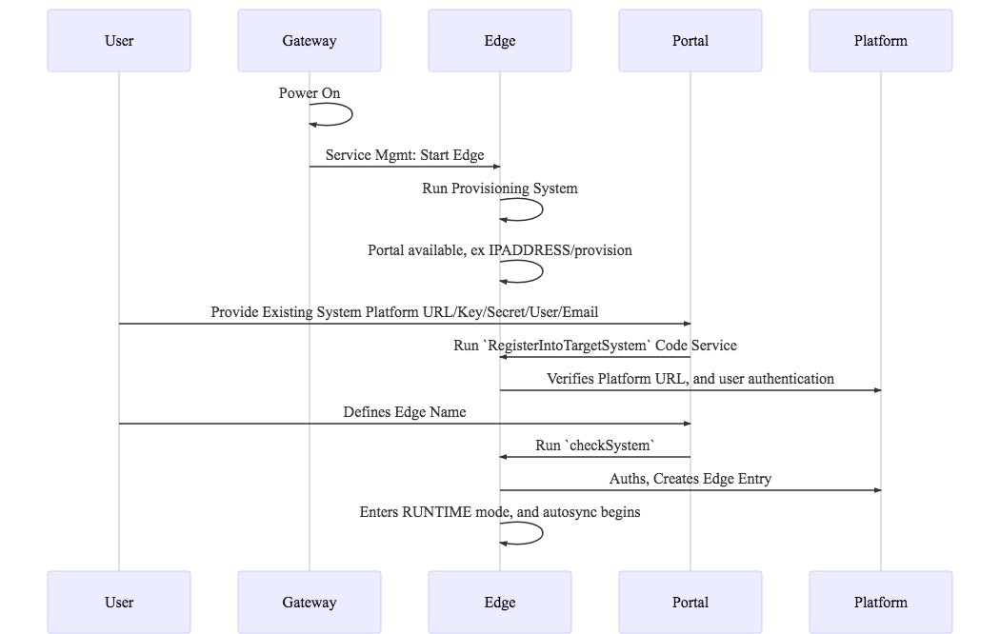

# ClearBlade Development Kit

## Overview

ClearBlade Development Kit (CDK) provides an out-of-the-box application for deploying ClearBlade's Edge Computing Platform.

## Prereqs

`ClearBlade Platform System` - A system created in a ClearBlade Platform, such as platform.clearblade.com
`Clearblade Edge System` - A system running on a particular Edge

You must have a `ClearBlade Platform System` to which to attach this Edge.

## Setup

1. In your pre-existing system, create a service user account with any email account. Example: provisioner@clearblade.com.

2. Grant this user a role with Edge Create permissions.

3. Configure a Deployment that is applied to 'All Current and Future Edges'

4. Download and unzip the release kit for your OS and Architecture (ex. amd64-darwin)


## Usage

1. Open two terminal windows and run these commands in each:

```
./runEdge.sh
```
```
./runConsole.sh
```

2. Open browser to <GATEWAY_IP>:3000/provision 

(ex. localhost:3000/provision, or 192.168.7.130:3000/provision)

3. You will be prompted provide the following information

|Parameter|Overview|Example|
|---|---|---|
|Platform URL|Platform on which your `ClearBlade Platform System` is running|https://platform.clearblade.com|
|System Key|`ClearBlade Platform System` System Key|82b1f1bb0beebcebd28fa88590e302|
|System Secret|`ClearBlade Platform System` System Secret|82B1F1BB0BCEA6FCB4C0BBFAC5DE02|
|User Email|Created in Step 1|provisioner@clearblade.com|
|User Password|Created in Step 1|<PASSWORD>|
|Edge Name|Unique Edge Name for this Edge|Gateway1424847363|


4. Your Edge will now be provisioned into the targetted system.

## Detailed workflow



